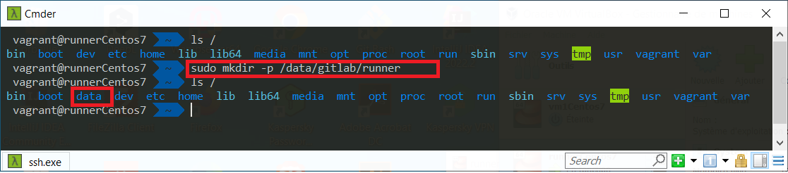
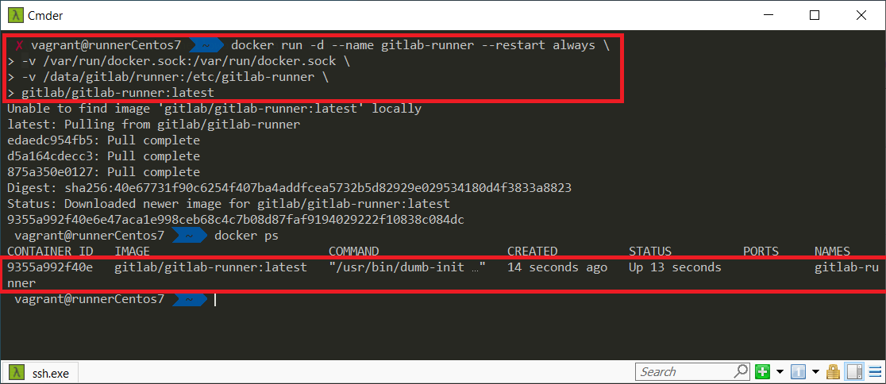
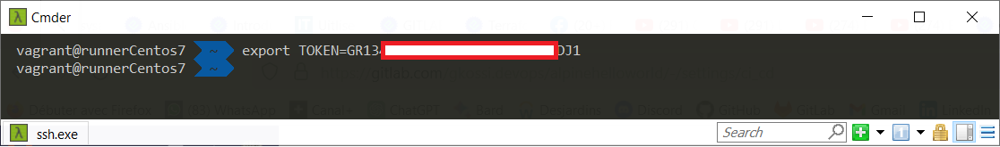
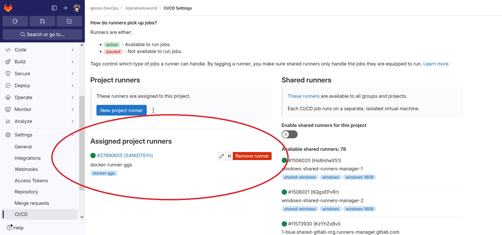

# Infos sur le réalisateur du projet
Session       : Bootcamp DevOps N°15 de Eazytraining

Nom & Prénoms : GBENOU Kossi

LinkedIn      : https://www.linkedin.com/in/gkossi/

# LAB 1 : BUILD
- Créez un compte sur gitlab.com
- Créez un repo
- Récupérez le code de l'application et poussez le sur votre repo https://github.com/eazytrainingfr/alpinehelloworld.git
- Créez votre fichier .gitlab-ci.yml
- Créez un job qui va permettre de builder votre application sous forme d'image docker à partir du Dockerfile fourni dans le dossier de l'application
- Lancez votre pipeline et validez que l'image est bien buildée

# Les besoins
Pour mon travail j'aurai besoin de :

1) Créer et enregistrer mon propre runner privé à partir d'un conteneur Docker qui sera chargé d'exécuter le pipeline

Utiliser Virtualbox comme hyperviseur pour la création de machines virtuelles
Utiliser Vagrant comme provisionneur d'infrastructure pour gérer la VM
Installer Docker et Docker-compose sur la VM
Construire un conteneur pour chaque module (Backend & Fronted)
Faire interagir les conteneurs entre eux
Fournir un registre privé pour stocker les images

# Mon plan de travail


# Les fichiers et leurs roles chacun


# REALISATIONS ETAPE PAR ETAPE
Pour réaliser ce projet de A à Z, je vais suivre les étapes suivantes :

## Etape N°1: Création et enregistrement du runner privé à partir d'un conteneur Docker

*NB : On suppose que l'engine docker est déjà installé et est fonctionnelle

- Documentation pour la création et l'enregistrement du runner privé : https://docs.gitlab.com/runner/register

- On va créer un répertoire qui sera utilisé en sytem volume mount (bind mount) dans le conteneur docker qui servira de runner privé.
```bash
sudo mkdir -p /data/gitlab/runner
```
> ![1-Création du répertoire runner] 

- On va créer le conteneur avec la méthode du "local system volume mounts" :
```bash
docker run -d --name gitlab-runner --restart always \
-v /var/run/docker.sock:/var/run/docker.sock \
-v /data/gitlab/runner:/etc/gitlab-runner \
gitlab/gitlab-runner:latest
```
> ![1-Création du runner] 

- Une fois notre runner créé, il faut l'enregistrer pour qu'il soit visible sur gitlab.com pour etre utilisé.

Pour cela, je vais aller copier le token sur gitlab.com

> ![1-Copie du Token sur gitlab.com] 

```bash
export TOKEN=mon-token-copié
```
> ![1-Enregistrement du runner] 

- Enregistrer le runner avec le jeton d'enregistrement (cette structure de commande s'applique seulement aux registre encours d'exécution dans un conteneur Docker) :
```bash
docker run --rm -v /data/gitlab/runner/:/etc/gitlab-runner gitlab/gitlab-runner register \
  --non-interactive \
  --executor "docker" \
  --docker-image docker:dind \
  --url "https://gitlab.com/" \
  --registration-token $TOKEN \
  --description "docker-runner-ggs" \
  --tag-list "docker-ggs" \
  --run-untagged="true" \
  --locked="false" \
  --access-level="not_protected" \
  --docker-privileged \
  --docker-volumes '/var/run/docker.sock:/var/run/docker.sock'
```
> ![1-Enregistrement du runner] 

> ![1-Vérification du runner sur gitlab.com] 

NB : il faut s'assurer de désactiver le runner partagé sur gitlab.com


## Etape N°2: Configuration du fichier .gitlab-ci.yml pour la réalisation du BUILD de l'image

```bash

```


