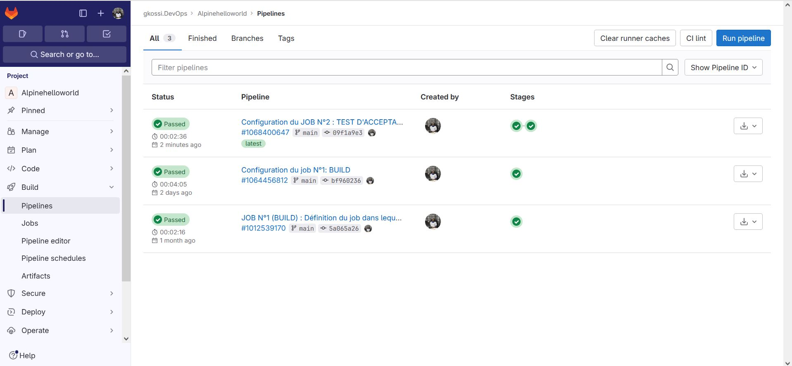
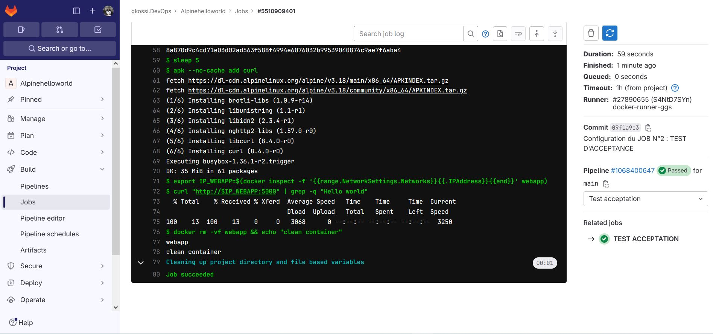

# Infos sur le réalisateur du projet
Session       : Bootcamp DevOps N°15 de Eazytraining

Nom & Prénoms : GBENOU Kossi

LinkedIn      : https://www.linkedin.com/in/gkossi/

# Lien d'accès à mon projet sur GITLAB
👉 https://gitlab.com/gkossi.devops/alpinehelloworld.git

# LAB 2 : TEST D'ACCEPTANCE
- Modifiez le pipeline afin de rajouter un job qui lance l'image buildée et la teste à l'aide de curl
- Le curl doit tester si le site contient bien « Hello world ! »
- Vous aurez un soucis car l'image n'existera pas au moment où vous allez lancer le conteneur (la variable $PORT pourra etre mise à 80)
- Vous allez utiliser la notion d'artefact pour permettre à l'image d'etre vue par le job
- Indice : vous devez utiliser comme « path » le répertoire où docker stocke les images suivants (vous pouvez utiliser la notion d'import et export d'image docker)
- Si le test avec curl passe, alors vous etes pret pour la prochaine étape

# Les besoins
Ce LAB N°2 (TEST D'ACCEPTANCE) est l'étape qui suit le LAB N°1 (BUILD).
Et donc, on va continuer à utiliser l'environnement déjà mis en place dans le Lab1 (runner privé)


## Etape N°2: Configuration du Job N°2 : Test d'acceptance

```bash

#JOB N°2 (TEST D'ACCEPTATION) :
TEST ACCEPTATION:
  stage: Test acceptation
  script:
    #On va supprimer le conteneur webapp si elle existe déjà
    - docker rm -vf webapp && echo "conteneur déjà supprimé"
    #On va ensuite supprimer l'image alpinehelloworld si elle existe déjà
    - docker rmi alpinehelloworld || echo "image déjà supprimée"
    #On va récupérer à nouveau l'image alpinehelloworld
    - docker load < alpinehelloworld.tar
    #On va créer à nouveau le conteneur webapp
    - docker run -d -p 8000:5000 -e PORT=5000 --name webapp alpinehelloworld
    - sleep 5
    #On va installer curl dans l'environnement docker:latest utilisé
    - apk --no-cache add curl
    - export IP_WEBAPP=$(docker inspect -f '{{range.NetworkSettings.Networks}}{{.IPAddress}}{{end}}' webapp)
    - curl "http://$IP_WEBAPP:5000" | grep -q "Hello world"
    #- curl "http://docker" | grep -q "Hello world!"
    - docker rm -vf webapp && echo "conteneur déjà supprimé"
```

> ![1-Lancement automatique du pipeline avec le runner privé] 

> ![2-Exécution du JOB N°2 : TEST D'ACCEPTANCE] 


