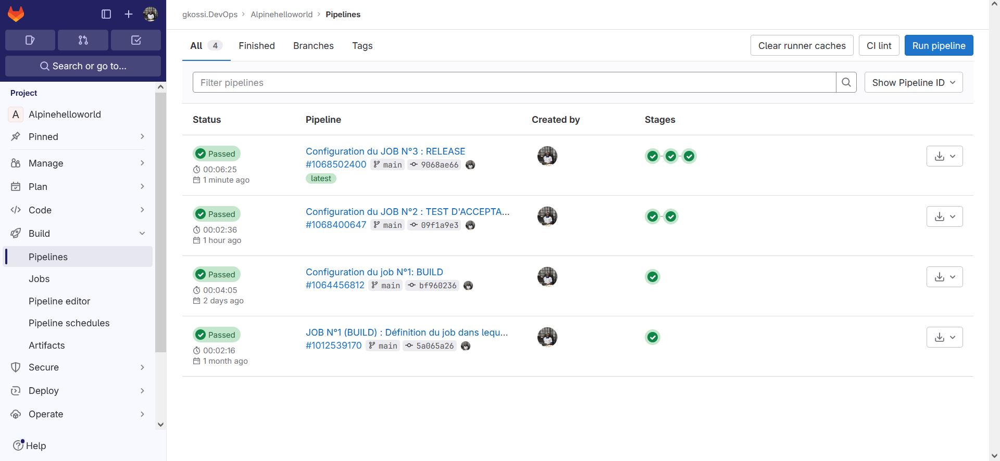
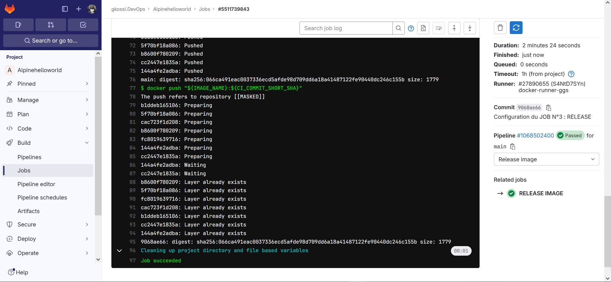
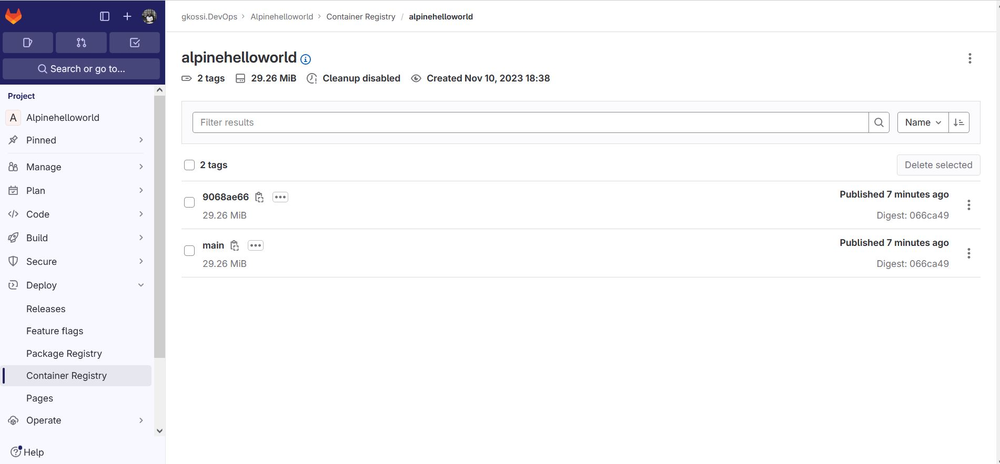

# Infos sur le réalisateur du projet
Session       : Bootcamp DevOps N°15 de Eazytraining

Nom & Prénoms : GBENOU Kossi

LinkedIn      : https://www.linkedin.com/in/gkossi/

# Lien d'accès à mon projet sur GITLAB
👉 https://gitlab.com/gkossi.devops/alpinehelloworld.git

# LAB 3 : RELEASE
- Créez un job qui va tagguer l'image avec deux tag, un qui représentera la branche et l'autre qui représentera le SHA court (voir variable d'environnement prédéfinies)
- Pour donner le nom de votre image, vous allez définir ce dernier à l'aide de la variable d'environnement que vous appelerez lors du tag
- Poussez l'image tagguée sur votre private registry gitlab
- Vérifiez que l'image a bien été poussée avec les bons tags
- Si c'est le cas, votre release est terminée, vous etes pret pour la suite

# Les besoins
Ce LAB N°3 (TEST D'ACCEPTANCE) est l'étape qui suit le LAB N°2 (TEST D'ACCEPTANCE).
Et donc, on va continuer à utiliser l'environnement déjà mis en place dans les Lab 1&2 (runner privé)

NB : On va d'abord configurer nos variables d'environnement : Settings => CI/CD => Variables

IMAGE_NAME : registry.gitlab.com/gkossi.devops/alpinehelloworld


## Etape N°3: Configuration du Job N°3 : Release

```bash

#JOB N°3 (RELEASE) :
RELEASE IMAGE:
  stage: Release image
  script:
    #On va d'abord récupérer l'image
    - docker load < alpinehelloworld.tar
    #On va créer un 1er tag de l'image avec la branche
    - docker tag alpinehelloworld "${IMAGE_NAME}:${CI_COMMIT_REF_NAME}"
    #On va créer un 2è tag de l'image avec le commit
    - docker tag alpinehelloworld "${IMAGE_NAME}:${CI_COMMIT_SHORT_SHA}"
    #On va se logger dans le registre privé
    - docker login -u "$CI_REGISTRY_USER" -p "$CI_REGISTRY_PASSWORD" $CI_REGISTRY
    #En fin, on push l'image dans le registre privé
    - docker push "${IMAGE_NAME}:${CI_COMMIT_REF_NAME}"
    - docker push "${IMAGE_NAME}:${CI_COMMIT_SHORT_SHA}"
	
```

> ![1-Lancement automatique du pipeline avec le runner privé] 

> ![2-Exécution du JOB N°3 : RELEASE IMAGE] 

> ![3-Release pushé dans le registry privé] 


