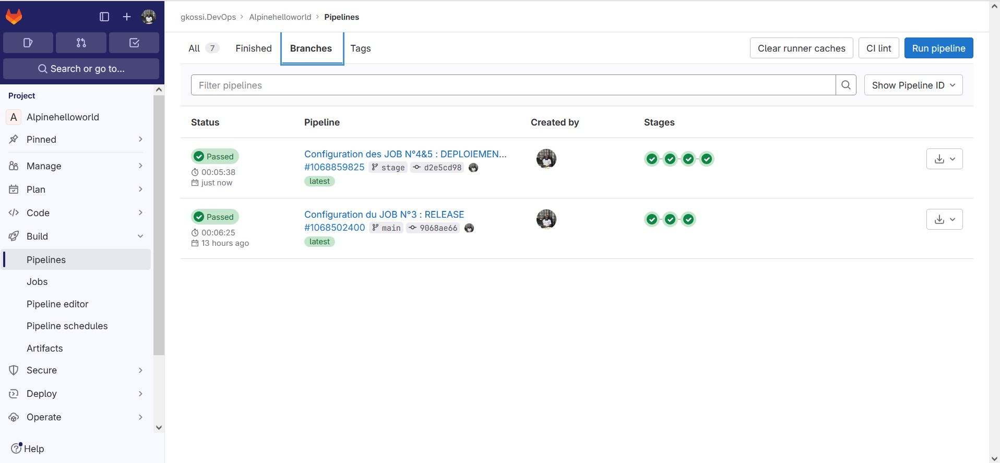

# Infos sur le réalisateur du projet
Session       : Bootcamp DevOps N°15 de Eazytraining

Nom & Prénoms : GBENOU Kossi

LinkedIn      : https://www.linkedin.com/in/gkossi/

# Lien d'accès à mon projet sur GITLAB
👉 https://gitlab.com/gkossi.devops/alpinehelloworld.git

# LAB 2 : TEST D'ACCEPTANCE
- Créez un compte heroku
- Créez un token pour l'api
- Créez une variable d'environnement nommée HEROKU_API_KEY avec le contenu de la clé créée
- Rajouter deux jobs qui permettront de déployer le conteneur en prod et un en staging (deux environnements seront nécessaires avec 2 projets heroku)
- Le déploiement ne doit se faire que sur la branche master
- Vous pourrez vous inspirez de cette documentation https://devcenterheroku.com/articles/container-registry-and-runtime
- Pour avoir la ligne de commande, vous pourrez utiliser l'utilitaire npm pour installer directement dans votre pipeline

# Les besoins
Ce LAB N°2 (TEST D'ACCEPTANCE) est l'étape qui suit le LAB N°1 (BUILD).
Et donc, on va continuer à utiliser l'environnement déjà mis en place dans le Lab1 (runner privé)


## Etape N°2: Configuration du Job N°2 : Test d'acceptance

```bash

#JOB N°2 (TEST) :
TEST ACCEPTATION:
  stage: Test acceptation
  script:
    #On va supprimer l'image alpinehelloworld si elle existe déjà
    - docker rmi alpinehelloworld || echo "image already deleted"
    #On va récupérer à nouveau l'image alpinehelloworld
    - docker load < alpinehelloworld.tar
    #On va supprimer le conteneur webapp s'il existe déjà
    - docker rm -vf webapp || echo "container already cleaned"
    #On va créer à nouveau le conteneur webapp
    - docker run -d -p 80:5000 -e PORT=5000 --name webapp alpinehelloworld
    - sleep 5
    #On va installer curl dans l'environnement docker:latest utilisé
    - apk --no-cache add curl
    - export IP_WEBAPP=$(docker inspect -f '{{range.NetworkSettings.Networks}}{{.IPAddress}}{{end}}' webapp)
    - curl "http://$IP_WEBAPP:5000" | grep -q "Hello world"
    #- curl "http://docker" | grep -q "Hello world!"
    - docker rm -vf webapp && echo "clean container"
	
```

> ![1-Lancement automatique du pipeline avec le runner privé] 

> ![2-Exécution du JOB N°2 : TEST D'ACCEPTANCE] 


