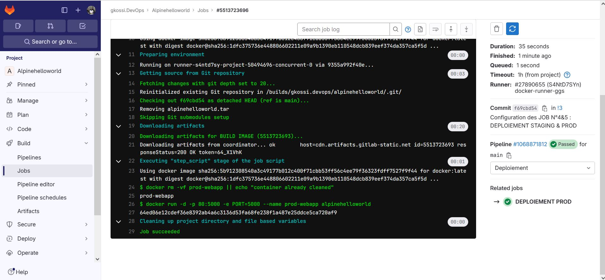

# Infos sur le réalisateur du projet
Session       : Bootcamp DevOps N°15 de Eazytraining

Nom & Prénoms : GBENOU Kossi

LinkedIn      : https://www.linkedin.com/in/gkossi/

# Lien d'accès à mon projet sur GITLAB
👉 https://gitlab.com/gkossi.devops/alpinehelloworld.git

# LAB 4 : DEPLOIEMENT
- Créez un compte sur heroku
- Créez un token pour l’api
- Créez une variable d’environnement nommée HEROKU_API_KEY avec le contenu de la clé créée
- Rajouter deux jobs qui permettront de déployer le conteneur en prod et un staging (deux environnements seront nécessaires avec 2 projets sur heroku
- Le déploiement ne doit se faire que sur la branche main
- Vous pourrez vous inspirer de cette documentation https://devcenter.heroku.com/articles/container registry and runtime
- Pour avoir la ligne de commande, vous pourrez utiliser l’utilitaire npm pour l’installer directement dans votre pipeline

### NB : Pour des raisons de changements apportés au niveau d'heroku, nous allons effectuer les déploiements PROD et STAGING en local sur la machine servant de runner privé

# Les besoins
Ce LAB N°4 (DEPLOIEMENT PROD & STAGING) est l'étape qui suit le LAB N°3 (RELEASE).
Et donc, on va continuer à utiliser l'environnement déjà mis en place dans les Lab 1, 2 & 3 (runner privé)

## Etape N°4: Configuration du Job N°4 : Déploiement staging

```bash
#JOB N°4 (DEPLOIEMENT STAGING) :
DEPLOIEMENT STAGING:
  stage: Deploiement
  only:
    - stage
  script:
    #On va supprimer le conteneur webapp s'il existe déjà
    - docker rm -vf stage-webapp || echo "container already cleaned"
    #On va lancer le conteneur
    - docker run -d -p 9000:5000 -e PORT=5000 --name stage-webapp alpinehelloworld
```

## Etape N°5: Configuration du Job N°5 : Déploiement prod

```bash
#JOB N°5 (DEPLOIEMENT PROD) :
DEPLOIEMENT PROD:
  stage: Deploiement
  only:
    - main
  script:
    #On va supprimer le conteneur webapp s'il existe déjà
    - docker rm -vf prod-webapp || echo "container already cleaned"
    #On va lancer le conteneur
    - docker run -d -p 80:5000 -e PORT=5000 --name prod-webapp alpinehelloworld
```

> ![1-Lancement automatique du pipeline avec le runner privé] 

> ![2-Exécution du JOB N°4&5 : DEPLOIEMENT PROD & STAGING] 

> ![3-Conteneurs Stage et Prod en cours d'exécution] 


